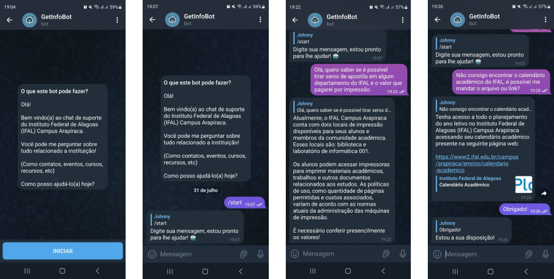

###### Português (BR):
# GetInfoBot
**Chatbot para Facilitar o Acesso a Informações sobre a instituição de Ensino do Aluno**

GetInfoBot é um chatbot de regras preestabelecidas que oferece assistência a alunos permitindo um acesso fácil e rápido a informações sobre a instituição de ensino.

## Chatbot por Regras
- Um chatbot por regras realiza tarefas objetivas a partir do que está em sua base de dados, possuindo um vocabulário limitado ao que foi configurado no fluxo de conversa. Abaixo pode ser conferido o fluxo de funcionamento de um chatbot por regras:

  

1. **Início do Chatbot** - mensagem explicativa ou de boas vindas.
2. **Entrada do Usuário** - o usuário insere uma mensagem.
3. **Análise de Intenção** - o texto é analisado para determinar a intenção por trás da mensagem.
4. **Correspondêcnia de Regras** - com base na intenção identificada, o chatbot procura por regras preestabelecidas.
5. **Resposta do Chatbot** - se uma regra corresponder à intenção, o chatbot responde com uma mensagem predefinida associada a essa regra.

## Processamento de Linguagem Natural

A análise da intenção do usuário por meio da leitura do texto é realizada utilizando técnicas de Processamento de Linguagem Natural (PLN). Para isso, no código Python, foram incorporadas bibliotecas importantes como NLTK e Unidecode, permitindo a aplicação das seguintes técnicas de pré-processamento de texto:

| Técnica de PLN                 | Descrição                                                                                                                                                                                        |
|--------------------------------|--------------------------------------------------------------------------------------------------------------------------------------------------------------------------------------------------|
| Tokenização                    | É o processo de dividir o texto em unidades menores, geralmente palavras ou símbolos, para que o computador possa entender e processar a linguagem de forma mais eficiente.                |
| Conversão para minúsculas      | Ajuda a tratar palavras que podem estar em maiúsculas ou minúsculas de forma uniforme, evitando distinções desnecessárias entre elas.                                                     |
| Remoção de acentos             | Ajuda a reduzir as variações de caracteres e a normalizar o texto, permitindo que as palavras acentuadas e não acentuadas sejam tratadas de forma igual.                                |
| Remoção de caracteres não alfanuméricos | Esse processo ajuda a eliminar pontuações e outros símbolos que não são relevantes para a análise da linguagem.                                                                     |
| Remoção de stopwords           | Stopwords são palavras comuns que geralmente são removidas do texto, pois não contribuem significativamente para o significado (ex: "as", "os", "com", etc).                       |
| Stemming                       | Trata de variações morfológicas, reduzindo as palavras às suas raízes (ou "stems"), para que palavras semelhantes sejam tratadas como iguais (ex: "correr" e "correndo" se tornam "corr").    |

## Palavras-chave (Keywords)

As keywords são palavras ou frases específicas que são identificadas pelo chatbot para determinar a intenção do usuário e corresponder a uma resposta pré-definida associada a essa intenção.

Na tabela abaixo podem ser vistas as palavras-chave e sua ligação com os assuntos do qual o chatbot irá abranger:

| Assunto           | Abrange                                                 | Keywords                                              |
|-------------------|---------------------------------------------------------|-------------------------------------------------------|
| INFO. BÁSICAS     | Funcionamento, localização e acesso à instituição.      | "localização", "horario", "funcionamento"             |
| CONTATOS          | Secretaria acadêmica, suporte ao aluno, etc.            | "secretaria", "coordenacao", "atendimento"            |
| COMUNICAÇÃO       | Site e redes sociais.                                   | "perfil", "site", "redes sociais"                     |
| MATRÍCULA         | Documentos necessários e prazos.                        | "matricula", "inscricao", "documentos"                |
| CURSOS            | Lista de cursos, duração, área, etc.                    | "cursos", "ofertados", "area"                         |
| CALENDÁRIO        | Consulta ao arquivo do calendário acadêmico.            | "calendario", "feriado", "aula"                       |
| OPORTUNIDADES     | Programas de bolsas, auxílio e editais.                 | "bolsa", "editais", "auxilio"                         |
| RECURSOS          | Laboratório de informática, impresora, etc.             | "laboratorio", "impressora", "xerox"                  |
| BIBLIOTECA        | Empréstimo e devolução de livros.                       | "livros", "emprestimo", "devolucao"                   |
| EVENTOS           | Eventos acadêmicos, palestras, etc.                     | "evento", "seminario", "palestra"                     |
| POLÍTICAS         | Regras relacionadas a ética acadêmica.                  | "faltas", "reprovacao", "conduta"                     |
| ESTÁGIO           | Onde encontrar oportunidades de estágio.                | "estagio", "intercambio", "emprego"                   |
| REFEITÓRIO        | Onde se alimentar na instituição.                       | "alimentacao", "cantina", "refeitorio"                |

## Telegram

O GetInfoBot funciona no aplicativo de mensagens Telegram por meio de sua API. As imagens abaixo mostram o chatbot em funcionamento.

  

O usuário tem liberdade para digitar mensagens, porém, o chatbot tem suas limitações e pode não reconhecer sentenças que não estejam de acordo com as regras preestabelecidas. Portanto, é importante que o usuário seja descritivo em suas mensagens e utilize palavras mais gerais, evitando o uso de gírias.
