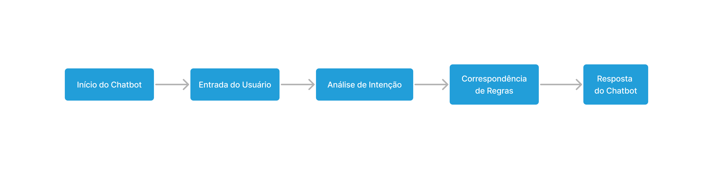

###### Português (BR):

<h1>UM CHATBOT PARA FACILITAR O ACESSO A INFORMAÇÕES SOBRE A INSTITUIÇÃO DE ENSINO DO ALUNO</h1>

<section>
  <h2>Descrição do Projeto</h2>
  
<em>Este estudo explora o desenvolvimento de um chatbot projetado para aprimorar a gestão educacional, proporcionando aos alunos acesso abrangente a informações institucionais. A motivação surge da insatisfação dos alunos atribuída à desorganização das informações e à falta de comunicação eficaz. O chatbot tem a intenção de fornecer detalhes como informações de contato, serviços de suporte, eventos    pedagógicos agendados, calendários acadêmicos e oportunidades como bolsas e estágios.</em>

</section>

<section>
  <h3>Informações adicionais:</h3>
  
<em>Este projeto foi apresentado como meu trabalho de conclusão de curso da Especialização Latu Sensu em Docência para a Educação Profissional e Tecnológica realizado pelo <a href="https://www2.ifal.edu.br/">IFAL</a></em>

  <ul>
    <li><em>O artigo pode ser conferido na pasta <a href="https://github.com/johnnycleiton07/educational-chatbot/tree/main/TCC%20(artigo%20final)">TCC (artigo final)</em></a></li>
  </ul>
</section>

<section>
  <h2>Contexto e Desenvolvimento</h2>
  
<em>Seu desenvolvimento foi pautado nas seguintes etapas: planejamento, análise de usuário, prototipação, implementação e testes. O chatbot foi desenvolvido na linguagem python e tem seu funcionamento através do <a href="https://t.me/botfather">The BotFather</a>, uma API do aplicativo Telegram. O chatbot é de característica híbrida, ou seja, funciona a base de regras, mas possui técnicas de Processamento de Linguagem Natural (PLN) no pré-processamento do texto de entrada do usuário.</em>

  <h4>Chatbot baseado em regras</h4>
  
<em>Um chatbot por regras realiza tarefas objetivas a partir do que está em sua base de dados, possuindo um vocabulário limitado ao que foi configurado no fluxo de conversa. Abaixo pode ser conferido o fluxo de funcionamento de um chatbot por regras:</em>

  

  
  

<em>As keywords são palavras ou frases específicas que são identificadas pelo chatbot para determinar a intenção do usuário e corresponder a uma resposta pré-definida associada a essa intenção.</em>

<em>Na tabela abaixo podem ser vistas as palavras-chave e sua ligação com os assuntos do qual o chatbot desenvolvido abrange:</em>

| Assunto           | Abrange                                                 | Keywords                                              |
|-------------------|---------------------------------------------------------|-------------------------------------------------------|
| INFO. BÁSICAS     | Funcionamento, localização e acesso à instituição.      | "localização", "horario", "funcionamento"             |
| CONTATOS          | Secretaria acadêmica, suporte ao aluno, etc.            | "secretaria", "coordenacao", "atendimento"            |
| COMUNICAÇÃO       | Site e redes sociais.                                   | "perfil", "site", "redes sociais"                     |
| MATRÍCULA         | Documentos necessários e prazos.                        | "matricula", "inscricao", "documentos"                |
| CURSOS            | Lista de cursos, duração, área, etc.                    | "cursos", "ofertados", "area"                         |
| CALENDÁRIO        | Consulta ao arquivo do calendário acadêmico.            | "calendario", "feriado", "aula"                       |
| OPORTUNIDADES     | Programas de bolsas, auxílio e editais.                 | "bolsa", "editais", "auxilio"                         |
| RECURSOS          | Laboratório de informática, impresora, etc.             | "laboratorio", "impressora", "xerox"                  |
| BIBLIOTECA        | Empréstimo e devolução de livros.                       | "livros", "emprestimo", "devolucao"                   |
| EVENTOS           | Eventos acadêmicos, palestras, etc.                     | "evento", "seminario", "palestra"                     |
| POLÍTICAS         | Regras relacionadas a ética acadêmica.                  | "faltas", "reprovacao", "conduta"                     |
| ESTÁGIO           | Onde encontrar oportunidades de estágio.                | "estagio", "intercambio", "emprego"                   |
| REFEITÓRIO        | Onde se alimentar na instituição.                       | "alimentacao", "cantina", "refeitorio"                |

  <h4>Processamento de Linguagem Natural</h4>
  
<em>A análise da intenção do usuário por meio da leitura do texto é realizada utilizando técnicas de Processamento de Linguagem Natural (PLN). Para isso, no código Python, foram incorporadas bibliotecas importantes como NLTK e Unidecode, permitindo a aplicação das seguintes técnicas de pré-processamento de texto:</em>

</section>

| Técnica de PLN                 | Descrição                                                                                                                                                                                        |
|--------------------------------|--------------------------------------------------------------------------------------------------------------------------------------------------------------------------------------------------|
| Tokenização                    | É o processo de dividir o texto em unidades menores, geralmente palavras ou símbolos, para que o computador possa entender e processar a linguagem de forma mais eficiente.                |
| Conversão para minúsculas      | Ajuda a tratar palavras que podem estar em maiúsculas ou minúsculas de forma uniforme, evitando distinções desnecessárias entre elas.                                                     |
| Remoção de acentos             | Ajuda a reduzir as variações de caracteres e a normalizar o texto, permitindo que as palavras acentuadas e não acentuadas sejam tratadas de forma igual.                                |
| Remoção de caracteres não alfanuméricos | Esse processo ajuda a eliminar pontuações e outros símbolos que não são relevantes para a análise da linguagem.                                                                     |
| Remoção de stopwords           | Stopwords são palavras comuns que geralmente são removidas do texto, pois não contribuem significativamente para o significado (ex: "as", "os", "com", etc).                       |
| Stemming                       | Trata de variações morfológicas, reduzindo as palavras às suas raízes (ou "stems"), para que palavras semelhantes sejam tratadas como iguais (ex: "correr" e "correndo" se tornam "corr").    |

<section>
  <h2>Demonstração</h2>
  
<em>O funcionamento do chatbot através de uma demonstração com uma persona chamada Ana Júlia pode ser conferido no seguinte <a href="https://drive.google.com/file/d/1Q6Vczz-t0exoQQADfOQrE2DXwK1rLdCQ/view?usp=sharing">video</a>, onde a usuária faz perguntas relativas a cursos disponíveis e como funciona o processo seletivo do Instituto Federal de Alagoas.</em>

</section>

<em>OBS: o usuário tem liberdade para digitar mensagens, porém, o chatbot tem suas limitações e pode não reconhecer sentenças que não estejam de acordo com as regras preestabelecidas. Portanto, é importante que o usuário seja descritivo em suas mensagens e utilize palavras mais gerais, evitando o uso de gírias.</em>
